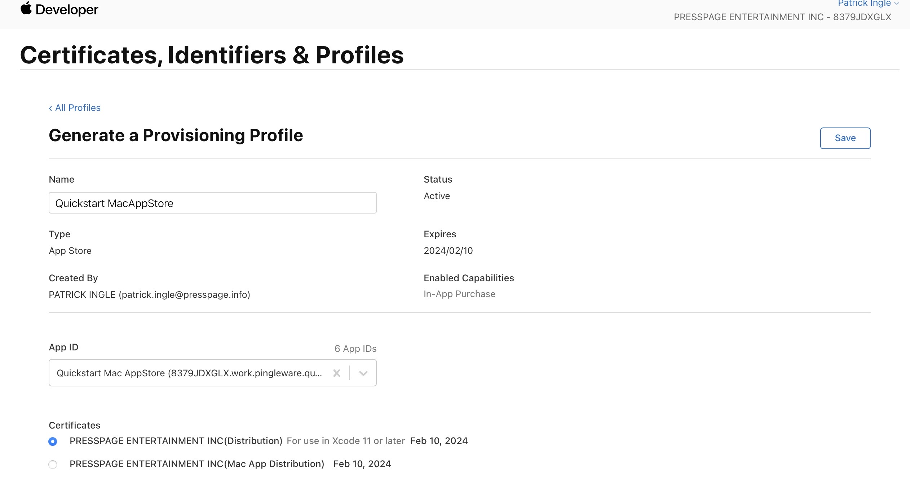

# electron-quickstart-mas

**Starter app to test building for the Mac App Store.**

This is the electron-quick-start app (see https://github.com/electron/electron-quick-start) set up to be built for the Mac App Store.

This app goes along with the tutorial https://www.techandstartup.com/tutorials/release-electron-app-on-mac-app-store (apparently this tutorial no longer exists)

**Steps to build this app for the mac app store:**

- Load the development dependencies electron and electron-builder: `npm install`
- Run it in dev mode to make sure it works: `npm run start`
- Add your own MacAppStore.provisionprofile to the build directory by creating a new Identifier followed by a new Profile.
- Add your own TeamID.appID in the entitlements.mas.plist file on line 9.
- In the package.json file at a minimum change the name and appId properties to your information.
- Build the app for the mac app store: `electron-builder --mac`
- To deploy to the MacSrtore, you need to create an new App (call it Quickstart by YOURNAME) and replace the productName in package.json with the name of your App.

**To build a Development version of this app (for testing) make the following changes:**

- Add your own AppleDevelopment.provisionprofile to the build directory.
- Make the following changes to the package.json file:
  - Change "target": "mas" to "target": "mas-dev".
  - Change "type": "distribution" to "type": "development".
  - Change "provisioningProfile": "build/MacAppStore.provisionprofile" to "provisioningProfile": "build/AppleDevelopment.provisionprofile".

## Deployment Issues

While Transporter uploaded and was able to execute Deliver, received the following issues on the first attempt,

```
Asset validation failed (90284)
Invalid Code Signing. The executable 'work.pingleware.quickstart.pkg/Payload/Quickstart by PINGLEWARE.app/Contents/Frameworks/Quickstart by PINGLEWARE Helper (Plugin).app/Contents/MacOS/Quickstart by PINGLEWARE Helper (Plugin)' must be signed with the certificate that is contained in the provisioning profile. (ID: 2031cfe5-fcf6-4597-aa56-7905dcb46a1b)Asset validation failed (90284)
Invalid Code Signing. The executable 'work.pingleware.quickstart.pkg/Payload/Quickstart by PINGLEWARE.app/Contents/Frameworks/Electron Framework.framework/Versions/A/Libraries/libvk_swiftshader.dylib' must be signed with the certificate that is contained in the provisioning profile. (ID: f2142104-d9aa-40d2-ad39-faf8ff2de628)Asset validation failed (90284)
Invalid Code Signing. The executable 'work.pingleware.quickstart.pkg/Payload/Quickstart by PINGLEWARE.app/Contents/Frameworks/Electron Framework.framework/Versions/A/Libraries/libswiftshader_libEGL.dylib' must be signed with the certificate that is contained in the provisioning profile. (ID: 7ac7c6d2-bafa-4e98-acb8-d141901026f4)Asset validation failed (90284)
Invalid Code Signing. The executable 'work.pingleware.quickstart.pkg/Payload/Quickstart by PINGLEWARE.app/Contents/Library/LoginItems/Quickstart by PINGLEWARE Login Helper.app/Contents/MacOS/Quickstart by PINGLEWARE Login Helper' must be signed with the certificate that is contained in the provisioning profile. (ID: 3ecd1555-9f82-4d30-99fc-3b198fee51d9)Asset validation failed (90284)
Invalid Code Signing. The executable 'work.pingleware.quickstart.pkg/Payload/Quickstart by PINGLEWARE.app/Contents/MacOS/Quickstart by PINGLEWARE' must be signed with the certificate that is contained in the provisioning profile. (ID: 90709244-9931-4cd7-882c-34bce6be6b55)Asset validation failed (90284)
Invalid Code Signing. The executable 'work.pingleware.quickstart.pkg/Payload/Quickstart by PINGLEWARE.app/Contents/Frameworks/Quickstart by PINGLEWARE Helper (Renderer).app/Contents/MacOS/Quickstart by PINGLEWARE Helper (Renderer)' must be signed with the certificate that is contained in the provisioning profile. (ID: b15a703f-9bee-4530-92d1-25954e2e8345)Asset validation failed (90284)
Invalid Code Signing. The executable 'work.pingleware.quickstart.pkg/Payload/Quickstart by PINGLEWARE.app/Contents/Frameworks/Quickstart by PINGLEWARE Helper (GPU).app/Contents/MacOS/Quickstart by PINGLEWARE Helper (GPU)' must be signed with the certificate that is contained in the provisioning profile. (ID: 94459c89-43fb-4c64-81af-e8bad1801ab4)Asset validation failed (90284)
Invalid Code Signing. The executable 'work.pingleware.quickstart.pkg/Payload/Quickstart by PINGLEWARE.app/Contents/Frameworks/Electron Framework.framework/Versions/A/Libraries/libGLESv2.dylib' must be signed with the certificate that is contained in the provisioning profile. (ID: 2be99ba6-9d8a-4f06-a825-0d120589e56b)Asset validation failed (90284)
Invalid Code Signing. The executable 'work.pingleware.quickstart.pkg/Payload/Quickstart by PINGLEWARE.app/Contents/Frameworks/Electron Framework.framework/Versions/A/Libraries/libswiftshader_libGLESv2.dylib' must be signed with the certificate that is contained in the provisioning profile. (ID: 22e99810-0011-4f93-93f3-899f6d3129fe)Asset validation failed (90869)
Invalid bundle. The “Quickstart by PINGLEWARE.app” bundle supports arm64 but not Intel-based Mac computers. Your build must include the x86_64 architecture to support Intel-based Mac computers. To support arm64 only, your macOS deployment target must be 12.0 or higher. For details, view: https://developer.apple.com/documentation/xcode/building_a_universal_macos_binary. (ID: 47b75a88-0b87-4d03-857f-41f0f761876f)Asset validation failed (90284)
Invalid Code Signing. The executable 'work.pingleware.quickstart.pkg/Payload/Quickstart by PINGLEWARE.app/Contents/Frameworks/Electron Framework.framework/Versions/A/Libraries/libffmpeg.dylib' must be signed with the certificate that is contained in the provisioning profile. (ID: 319b690a-c298-4f03-9a46-c8881dd7b29f)Asset validation failed (90284)
Invalid Code Signing. The executable 'work.pingleware.quickstart.pkg/Payload/Quickstart by PINGLEWARE.app/Contents/Frameworks/Quickstart by PINGLEWARE Helper.app/Contents/MacOS/Quickstart by PINGLEWARE Helper' must be signed with the certificate that is contained in the provisioning profile. (ID: 92fe68af-d365-4ad9-91e2-f3c87dab9bdd)Asset validation failed (90284)
Invalid Code Signing. The executable 'work.pingleware.quickstart.pkg/Payload/Quickstart by PINGLEWARE.app/Contents/Frameworks/Electron Framework.framework/Versions/A/Libraries/libEGL.dylib' must be signed with the certificate that is contained in the provisioning profile. (ID: 9cae12d3-2dc9-4676-a7e8-43439e3a8dde)Asset validation failed (90284)
Invalid Code Signing. The executable 'work.pingleware.quickstart.pkg/Payload/Quickstart by PINGLEWARE.app/Contents/Frameworks/Electron Framework.framework/Versions/A/Electron Framework' must be signed with the certificate that is contained in the provisioning profile. (ID: 62a16b3f-339c-4a3f-8ae3-f096a81ee296)
```

Adding --uinversal tp the electron-builder command, reduced the issues by one,

```
Asset validation failed (90284)
Invalid Code Signing. The executable 'work.pingleware.quickstart.pkg/Payload/Quickstart by PINGLEWARE.app/Contents/MacOS/Quickstart by PINGLEWARE' must be signed with the certificate that is contained in the provisioning profile. (ID: 58d88092-08f3-4fb4-93ee-b362aaca6451)

Asset validation failed (90284)
Invalid Code Signing. The executable 'work.pingleware.quickstart.pkg/Payload/Quickstart by PINGLEWARE.app/Contents/Frameworks/Quickstart by PINGLEWARE Helper (Plugin).app/Contents/MacOS/Quickstart by PINGLEWARE Helper (Plugin)' must be signed with the certificate that is contained in the provisioning profile. (ID: 346d13be-e83b-43c5-91c0-41812c5f54bf)

Asset validation failed (90284)
Invalid Code Signing. The executable 'work.pingleware.quickstart.pkg/Payload/Quickstart by PINGLEWARE.app/Contents/Frameworks/Quickstart by PINGLEWARE Helper (GPU).app/Contents/MacOS/Quickstart by PINGLEWARE Helper (GPU)' must be signed with the certificate that is contained in the provisioning profile. (ID: 75cc91e9-54c2-4484-bdc9-5cc185ec41f2)

Asset validation failed (90284)
Invalid Code Signing. The executable 'work.pingleware.quickstart.pkg/Payload/Quickstart by PINGLEWARE.app/Contents/Frameworks/Electron Framework.framework/Versions/A/Libraries/libswiftshader_libEGL.dylib' must be signed with the certificate that is contained in the provisioning profile. (ID: 12817185-eb78-45db-b3df-cef02064421a)

Asset validation failed (90284)
Invalid Code Signing. The executable 'work.pingleware.quickstart.pkg/Payload/Quickstart by PINGLEWARE.app/Contents/Frameworks/Electron Framework.framework/Versions/A/Libraries/libEGL.dylib' must be signed with the certificate that is contained in the provisioning profile. (ID: 186d197a-693b-4c17-b723-4d0d30417e8a)

Asset validation failed (90284)
Invalid Code Signing. The executable 'work.pingleware.quickstart.pkg/Payload/Quickstart by PINGLEWARE.app/Contents/Library/LoginItems/Quickstart by PINGLEWARE Login Helper.app/Contents/MacOS/Quickstart by PINGLEWARE Login Helper' must be signed with the certificate that is contained in the provisioning profile. (ID: 71e1b337-9609-4c97-81c9-7b722130e69e)

Asset validation failed (90284)
Invalid Code Signing. The executable 'work.pingleware.quickstart.pkg/Payload/Quickstart by PINGLEWARE.app/Contents/Frameworks/Electron Framework.framework/Versions/A/Libraries/libGLESv2.dylib' must be signed with the certificate that is contained in the provisioning profile. (ID: 75fac776-e54e-43d4-9516-c9da1fd73c60)

Asset validation failed (90284)
Invalid Code Signing. The executable 'work.pingleware.quickstart.pkg/Payload/Quickstart by PINGLEWARE.app/Contents/Frameworks/Quickstart by PINGLEWARE Helper (Renderer).app/Contents/MacOS/Quickstart by PINGLEWARE Helper (Renderer)' must be signed with the certificate that is contained in the provisioning profile. (ID: 53821517-19e4-44e0-8744-203e1c8e59df)

Asset validation failed (90284)
Invalid Code Signing. The executable 'work.pingleware.quickstart.pkg/Payload/Quickstart by PINGLEWARE.app/Contents/Frameworks/Electron Framework.framework/Versions/A/Libraries/libvk_swiftshader.dylib' must be signed with the certificate that is contained in the provisioning profile. (ID: 9560b06b-40b9-4abc-ac8a-2463d80dbaf6)

Asset validation failed (90284)
Invalid Code Signing. The executable 'work.pingleware.quickstart.pkg/Payload/Quickstart by PINGLEWARE.app/Contents/Frameworks/Electron Framework.framework/Versions/A/Libraries/libffmpeg.dylib' must be signed with the certificate that is contained in the provisioning profile. (ID: 07ed1f04-c680-409b-a909-5a003f1e4baa)

Asset validation failed (90284)
Invalid Code Signing. The executable 'work.pingleware.quickstart.pkg/Payload/Quickstart by PINGLEWARE.app/Contents/Frameworks/Quickstart by PINGLEWARE Helper.app/Contents/MacOS/Quickstart by PINGLEWARE Helper' must be signed with the certificate that is contained in the provisioning profile. (ID: 7ed37680-0265-4f8b-bea0-4d8a7097b223)

Asset validation failed (90284)
Invalid Code Signing. The executable 'work.pingleware.quickstart.pkg/Payload/Quickstart by PINGLEWARE.app/Contents/Frameworks/Electron Framework.framework/Versions/A/Electron Framework' must be signed with the certificate that is contained in the provisioning profile. (ID: e85481c3-bd1e-44c7-ac48-8ada03abaa8b)

Asset validation failed (90284)
Invalid Code Signing. The executable 'work.pingleware.quickstart.pkg/Payload/Quickstart by PINGLEWARE.app/Contents/Frameworks/Electron Framework.framework/Versions/A/Libraries/libswiftshader_libGLESv2.dylib' must be signed with the certificate that is contained in the provisioning profile. (ID: ff988f99-6bca-465b-8a38-462372c95a1f)
```


Change the Certificate  selection in the Profiles from Mac App Distribution and selected the Distribution certification and success, then downloaded the new provisioning profile #-2. See log



```
2023-03-21 14:40:56.598  INFO: ContentDelivery version 2.14.8 (14038).
2023-03-21 14:40:56.599  INFO: Show Progress: Contacting Apple Services…
2023-03-21 14:40:57.098  INFO: Show Progress: Making copy of ‘Quickstart_by_PINGLEWARE-1.0.0-universal.pkg’…
2023-03-21 14:40:57.100  INFO: Show Progress: Preparing to upload ‘Quickstart_by_PINGLEWARE-1.0.0-universal.pkg’…
2023-03-21 14:40:57.453  INFO: Show Progress: Analyzing package…
2023-03-21 14:41:33.753  INFO: Show Progress: Sending analysis to App Store Connect…
2023-03-21 14:41:34.640  INFO: COMPLETED - PART 1
2023-03-21 14:41:34.644  INFO: Show Progress: Waiting for App Store Connect analysis response…
2023-03-21 14:41:45.393  INFO: Show Progress: Collecting package attributes…
2023-03-21 14:41:45.394  INFO: Show Progress: Requesting upload instructions from App Store Connect…
2023-03-21 14:41:45.747  INFO: 30 upload operations were requested for 30 parts.
2023-03-21 14:41:45.748  INFO: Show Progress: Preparing file for upload to App Store Connect…
2023-03-21 14:41:45.753  INFO: Show Progress: Preparing file for upload to App Store Connect…
2023-03-21 14:41:46.181  INFO: Show Progress: Uploading to App Store Connect…
2023-03-21 14:41:46.607  INFO: Upload progress: 4.823%
2023-03-21 14:41:50.325  INFO: Upload progress: 11.025%
2023-03-21 14:41:55.573  INFO: Upload progress: 13.092%
2023-03-21 14:41:55.920  INFO: COMPLETED - PART 1
2023-03-21 14:41:56.898  INFO: Upload progress: 15.159%
2023-03-21 14:41:57.519  INFO: Upload progress: 15.848%
2023-03-21 14:41:58.062  INFO: Upload progress: 18.604%
2023-03-21 14:41:58.909  INFO: COMPLETED - PART 6
2023-03-21 14:41:59.019  INFO: Upload progress: 19.983%
2023-03-21 14:42:00.070  INFO: Upload progress: 20.672%
2023-03-21 14:42:00.593  INFO: Upload progress: 22.050%
2023-03-21 14:42:01.509  INFO: Upload progress: 22.739%
2023-03-21 14:42:02.351  INFO: Upload progress: 24.117%
2023-03-21 14:42:02.462  INFO: COMPLETED - PART 4
2023-03-21 14:42:03.451  INFO: Upload progress: 27.562%
2023-03-21 14:42:04.052  INFO: Upload progress: 28.251%
2023-03-21 14:42:04.927  INFO: Upload progress: 28.940%
2023-03-21 14:42:06.079  INFO: Upload progress: 29.629%
2023-03-21 14:42:07.082  INFO: Upload progress: 30.318%
2023-03-21 14:42:07.591  INFO: COMPLETED - PART 3
2023-03-21 14:42:07.697  INFO: Upload progress: 31.696%
2023-03-21 14:42:07.900  INFO: COMPLETED - PART 2
2023-03-21 14:42:08.118  INFO: COMPLETED - PART 7
2023-03-21 14:42:08.224  INFO: Upload progress: 34.453%
2023-03-21 14:42:08.922  INFO: Upload progress: 35.142%
2023-03-21 14:42:09.387  INFO: COMPLETED - PART 5
2023-03-21 14:42:09.496  INFO: Upload progress: 36.520%
2023-03-21 14:42:10.075  INFO: COMPLETED - PART 8
2023-03-21 14:42:10.171  INFO: Upload progress: 37.898%
2023-03-21 14:42:10.730  INFO: Upload progress: 39.965%
2023-03-21 14:42:11.767  INFO: Upload progress: 40.654%
2023-03-21 14:42:12.330  INFO: Upload progress: 42.032%
2023-03-21 14:42:12.870  INFO: Upload progress: 42.721%
2023-03-21 14:42:13.403  INFO: Upload progress: 43.410%
2023-03-21 14:42:13.637  INFO: COMPLETED - PART 9
2023-03-21 14:42:14.198  INFO: Upload progress: 45.478%
2023-03-21 14:42:14.943  INFO: Upload progress: 47.545%
2023-03-21 14:42:15.642  INFO: Upload progress: 48.234%
2023-03-21 14:42:16.276  INFO: Upload progress: 49.612%
2023-03-21 14:42:17.887  INFO: Upload progress: 50.301%
2023-03-21 14:42:19.914  INFO: Upload progress: 51.679%
2023-03-21 14:42:20.356  INFO: COMPLETED - PART 11
2023-03-21 14:42:20.464  INFO: Upload progress: 53.057%
2023-03-21 14:42:20.627  INFO: COMPLETED - PART 10
2023-03-21 14:42:21.582  INFO: COMPLETED - PART 13
2023-03-21 14:42:21.676  INFO: COMPLETED - PART 12
2023-03-21 14:42:21.690  INFO: Upload progress: 55.813%
2023-03-21 14:42:21.804  INFO: COMPLETED - PART 14
2023-03-21 14:42:22.336  INFO: Upload progress: 59.259%
2023-03-21 14:42:23.284  INFO: Upload progress: 60.637%
2023-03-21 14:42:24.255  INFO: Upload progress: 61.326%
2023-03-21 14:42:24.748  INFO: COMPLETED - PART 15
2023-03-21 14:42:24.832  INFO: Upload progress: 62.704%
2023-03-21 14:42:26.857  INFO: Upload progress: 66.149%
2023-03-21 14:42:27.371  INFO: Upload progress: 69.594%
2023-03-21 14:42:29.583  INFO: Upload progress: 70.284%
2023-03-21 14:42:30.249  INFO: Upload progress: 71.662%
2023-03-21 14:42:31.038  INFO: COMPLETED - PART 18
2023-03-21 14:42:31.147  INFO: Upload progress: 73.040%
2023-03-21 14:42:31.504  INFO: COMPLETED - PART 16
2023-03-21 14:42:32.235  INFO: Upload progress: 75.107%
2023-03-21 14:42:32.804  INFO: Upload progress: 75.796%
2023-03-21 14:42:33.038  INFO: COMPLETED - PART 17
2023-03-21 14:42:33.712  INFO: Upload progress: 77.863%
2023-03-21 14:42:35.039  INFO: Upload progress: 78.552%
2023-03-21 14:42:35.203  INFO: COMPLETED - PART 20
2023-03-21 14:42:35.775  INFO: COMPLETED - PART 19
2023-03-21 14:42:35.882  INFO: Upload progress: 81.997%
2023-03-21 14:42:37.209  INFO: Upload progress: 83.376%
2023-03-21 14:42:37.702  INFO: COMPLETED - PART 21
2023-03-21 14:42:37.808  INFO: Upload progress: 85.443%
2023-03-21 14:42:38.500  INFO: Upload progress: 87.510%
2023-03-21 14:42:39.353  INFO: Upload progress: 88.199%
2023-03-21 14:42:40.004  INFO: Upload progress: 88.888%
2023-03-21 14:42:40.788  INFO: Upload progress: 90.266%
2023-03-21 14:42:41.865  INFO: COMPLETED - PART 22
2023-03-21 14:42:41.973  INFO: Upload progress: 92.333%
2023-03-21 14:42:43.609  INFO: Upload progress: 93.711%
2023-03-21 14:42:45.022  INFO: Upload progress: 95.089%
2023-03-21 14:42:45.620  INFO: Upload progress: 95.779%
2023-03-21 14:42:45.644  INFO: COMPLETED - PART 25
2023-03-21 14:42:46.021  INFO: COMPLETED - PART 23
2023-03-21 14:42:46.619  INFO: COMPLETED - PART 30
2023-03-21 14:42:46.867  INFO: COMPLETED - PART 24
2023-03-21 14:42:46.976  INFO: Upload progress: 97.933%
2023-03-21 14:42:48.628  INFO: Upload progress: 99.311%
2023-03-21 14:42:48.808  INFO: COMPLETED - PART 27
2023-03-21 14:42:49.524  INFO: COMPLETED - PART 26
2023-03-21 14:42:49.840  INFO: Upload progress: 100.000%
2023-03-21 14:42:49.847  INFO: COMPLETED - PART 28
2023-03-21 14:42:51.366  INFO: COMPLETED - PART 29
2023-03-21 14:42:51.372  INFO: Time to transfer: 64.091 seconds (2374.37KB/s)
2023-03-21 14:42:51.376  INFO: Show Progress: Checking build state…
2023-03-21 14:42:51.376  INFO: Show Progress: Completing upload…
2023-03-21 14:42:52.769  INFO: Show Progress: Waiting for package to begin processing…
2023-03-21 14:42:52.884  INFO: Show Progress: Uploaded package is processing.
2023-03-21 14:42:53.420  INFO: Show Progress: Upload succeeded.
2023-03-21 14:42:53.421  INFO: 
================
UPLOAD SUCCEEDED
Delivery UUID: 4a65f9a2-a013-408e-a9b5-469ad22dca22
Transferred 152176138 bytes in 1.07 minutes (2.4MB/s)
================
```
